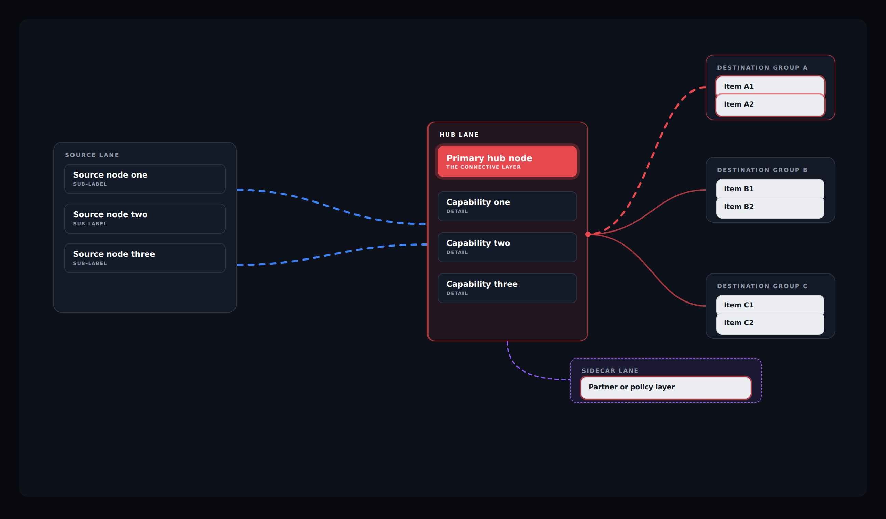

# 2D Solution Diagram Kit

A repeatable method for building animated 2D architecture diagrams that read
correctly in seconds — plus a working template you can fork.

**Fork `diagram-template.html`, rename the scope, swap the labels.**
Everything else in this repo explains why the template is shaped the way it is.



*The template running, captured mid-animation: one route lit toward a rotating
destination, the hub as the only saturated element, the sidecar checking policy.*

---

## The problem this solves

Architecture diagrams drawn without a system fail the same handful of ways:

- **No focal point.** Every box is styled equally, so the eye goes to whatever is
  brightest — usually the vendor logos on the right — instead of to the thing the
  diagram is supposed to be about.
- **Decorative colour.** Hues get assigned by taste, so the same colour means
  different things in two diagrams and the reader has to relearn the legend each time.
- **Animation as decoration.** Motion draws attention without telling the story,
  or it runs forever offscreen burning CPU.
- **Style leakage.** A component gets pasted into a page and its global `*`, `body`
  and `h1` rules clobber the host layout. (This one has actually happened here.)
- **Motion and keyboard failures.** Animation ignores `prefers-reduced-motion`,
  and definitions live in hover-only tooltips no keyboard user can reach.

The fix is a small set of non-negotiable rules plus a template that already
implements them.

---

## The method

### 1. One canvas

```
viewBox = "0 0 1240 700"
```

Nodes are absolutely positioned in that space. A `ResizeObserver` scales the whole
stage to its container — the layout never reflows, so nothing shifts or re-wraps at
different widths. Don't invent a new coordinate space per diagram.

### 2. Three semantic lanes, read left to right

```
SOURCE            →    HUB             →    DESTINATIONS
(left)                 (centre)             (right)
                         ↓
                      SIDECAR
                      (below)
```

Source is where work originates. Hub is the thing that connects. Destinations are
where work lands. The sidecar is the policy or partner layer that observes.

### 3. Colour is semantic, not decorative

One hue per lane. **Three hues total, and never a fourth.**

| Role | Meaning | Template placeholder |
|---|---|---|
| Source | customer-side workloads | `--source: #3B82F6` |
| Hub | the connective layer | `--hub: #E5484D` |
| Sidecar | partner / policy | `--sidecar: #8B5CF6` |

Replace the values with your brand's. Keep the roles. The moment a fourth hue
appears, the reader has to start decoding instead of reading.

### 4. Exactly one `.primary` node

The hub anchor is the only saturated, solid-filled element in the diagram. Everything
else is a dark node with a hairline border. If a viewer can't identify the centre of
the architecture within a few seconds, the diagram has failed — and the usual cause
is a second element competing with the hub.

Destination chips are deliberately **off-white, not pure white**. Pure white chips
out-shout the hub and pull the eye to the right edge.

### 5. Animation tells the story

The loop is a narrative, not an ambient shimmer:

1. A request leaves the source lane
2. The hub zone acknowledges
3. The primary node intensifies
4. **One** route fires toward a rotating destination
5. The destination brightens
6. The sidecar checks policy
7. Return, pause, repeat

Rotating the destination each cycle shows breadth without drawing every route at
once. Firing all routes simultaneously reads as noise.

### 6. Scope everything

All CSS and JS live under one id (`#dgm` in the template). Renaming that scope is
**step one** of forking, and a partial rename is exactly how styles leak into a host
page.

### 7. The accessibility contract

Non-negotiable, all three implemented in the template:

- `IntersectionObserver` **stops** the loop when the diagram scrolls out of view
- `prefers-reduced-motion: reduce` **hard-disables** every transition and animation
  and settles paths to a legible static state
- Tooltips open on `:focus-within` as well as `:hover`, and essential information
  never lives in a tooltip alone

---

## Quickstart

```
cp diagram-template.html my-diagram.html
```

Then:

1. Rename `#dgm` to your own scope — **every** selector, in CSS and JS.
2. Replace the three semantic hues in `:root`. Keep the roles.
3. Swap node labels, zone titles and destination chips.
4. Re-point the SVG paths and move the fan-out junction circle to match.
5. Verify against the checklist below.

### Verification checklist

- [ ] Scope renamed everywhere; no global `*`, `body` or `h1` rules escape it
- [ ] Exactly one `.primary` node
- [ ] Three hues, no fourth
- [ ] Animation pauses offscreen
- [ ] `prefers-reduced-motion` produces zero animation
- [ ] Tooltips reachable by keyboard
- [ ] No horizontal overflow at container widths from ~360px up
- [ ] No console errors

---

## What's in here

```
README.md                the method (this file)
SKILL.md                 Claude Skill — auto-triggers on diagram work
diagram-template.html    working, brand-neutral, fork this
design-system.md         tokens, type scale, zone and node specs
connectors.md            path geometry and state machine
accessibility.md         the motion and keyboard contract
walkthrough.md           building a diagram start to finish
template-preview.png     the template running, used above
```

Flat on purpose. Eight files don't need a folder tree.

---

## Status and scope

This is a **method and a template**, not a component library. There's no build step,
no dependencies and no package to install — the template is one HTML file that opens
in any browser.

Brand colours in the template are neutral placeholders. Swap them for your own
palette; the structure is what's being standardised, not the hues.

### Next evolution

The diagram is data-positioned, so it could be driven by a JSON config
(`{ source: [...], hub: {...}, destinations: [...] }`) that renders the SVG. That
turns "make a new diagram" into editing a config rather than moving paths. Worth
building once there are more than a handful of diagrams to maintain.
